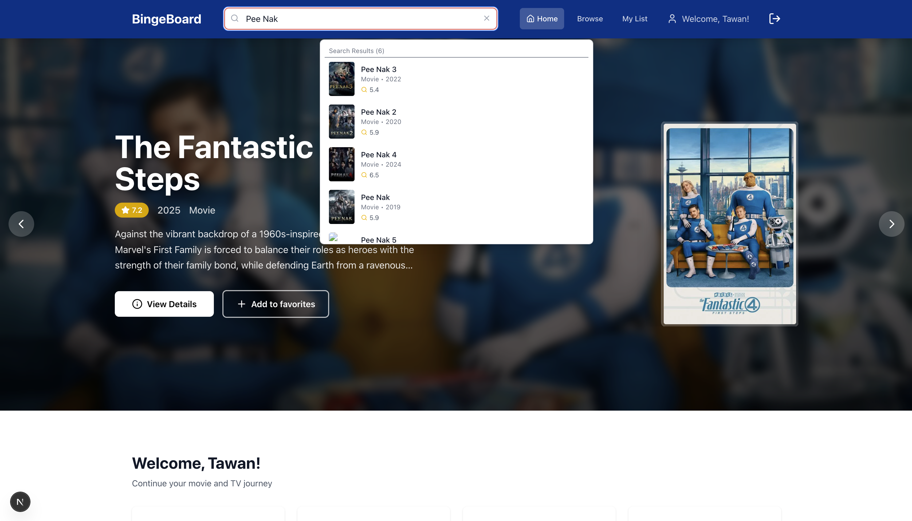
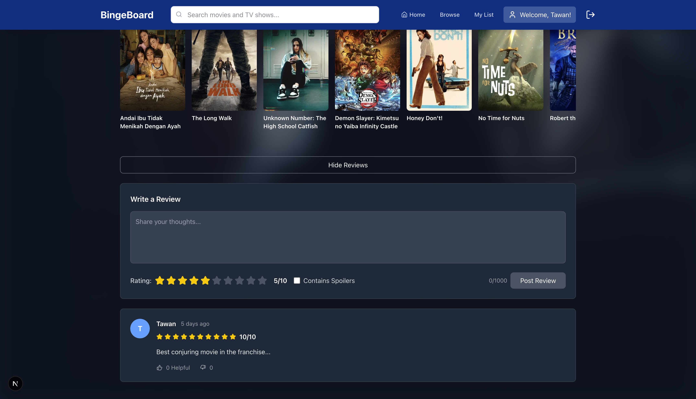

# 🎬 BingeBoard

A personal movie and TV show tracking platform where users can discover content, manage their watchlists, rate and review shows, and track their viewing progress.

## 👥 Team Members

- **Soe Min Min Latt** - https://github.com/Tawan0224
- **Min Thant** - https://github.com/Minn01

## 📖 Project Description

BingeBoard is a comprehensive movie and TV show tracking application that helps users:

- **Discover Content**: Browse trending movies and TV shows with rich metadata from The Movie Database (TMDB) API
- **Manage Watchlists**: Track what you've watched, currently watching, or want to watch
- **Rate & Review**: Rate movies/shows on a 1-10 scale and write detailed reviews
- **Progress Tracking**: Monitor your viewing progress, especially for TV shows with season/episode tracking
- **Personal Dashboard**: View personalized statistics and recommendations based on viewing history
- **Social Features**: Read reviews from other users and interact with the community

### ✨ Key Features

- **Hero Carousel**: Featuring trending content with stunning visuals
- **Smart Search**: Real-time search with TMDB integration and autocomplete
- **Responsive Design**: Works seamlessly on desktop, tablet, and mobile devices
- **User Authentication**: Secure login/registration system with JWT tokens
- **Personalized Experience**: Custom recommendations based on favorite genres
- **Cast & Crew Information**: Detailed information about actors and production team
- **Similar Content Recommendations**: Discover related movies and shows
- **Favorite System**: Mark content as favorites for quick access
- **User Profile Management**: Customize your profile and view your statistics

## 🛠️ Technical Stack

- **Frontend**: Next.js 15.5.1 (React 19.1.0)
- **Styling**: Tailwind CSS 4.0
- **Icons**: Lucide React
- **Carousel/Slider**: Swiper.js
- **Database**: MongoDB with Mongoose ODM
- **Authentication**: JWT with jose library
- **Password Hashing**: bcrypt
- **External API**: The Movie Database (TMDB) API
- **Language**: TypeScript
- **Deployment**: VM (non-serverless)

## 📱 Screenshots

### Login Page & Signup Page

### Home Page

### Browse & Search

### Movie/TV Show Details & Reviews

### User Profile

### Watchlist Management

